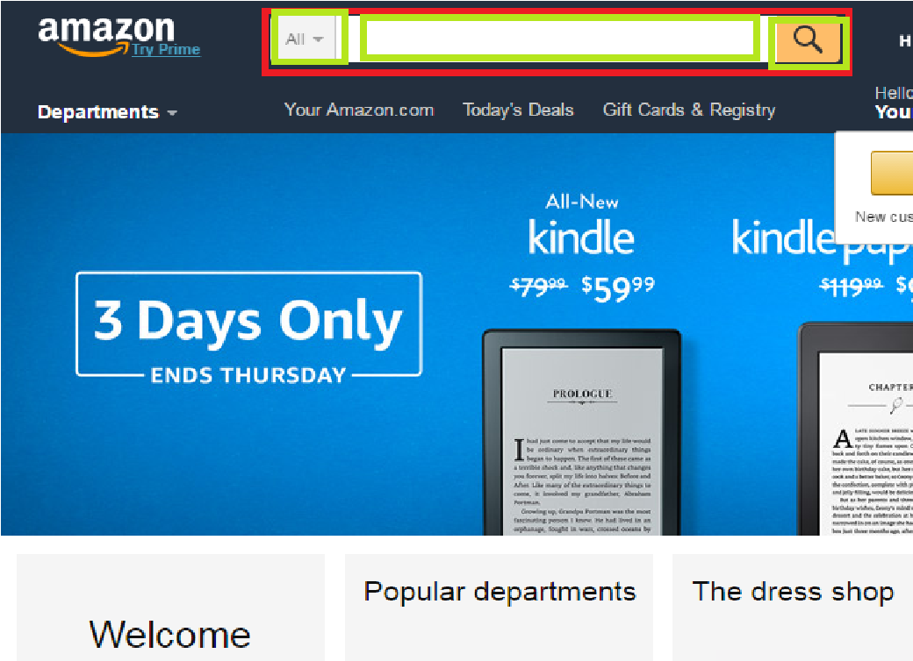
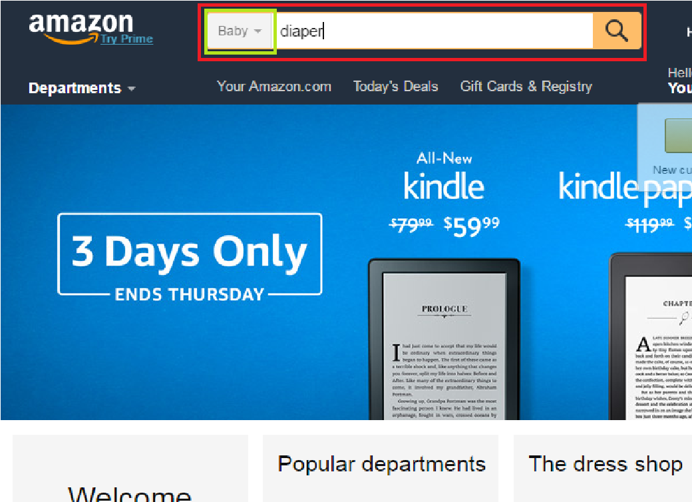
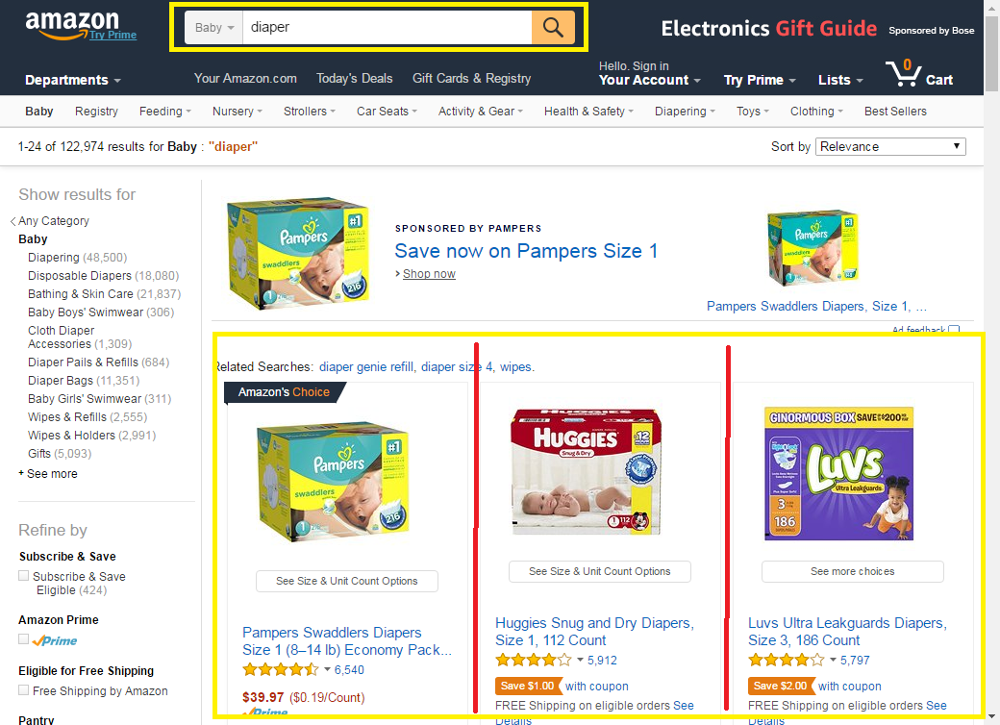

Today let's finish a small project with Selenium Automation Framework.

# Project scope
This project is very simple:

 1. Goto **www.amazon.com**
 2. Select **baby** department, Input diaper, and click search 
 3. Extract all product names and their prices, then print them out.

# Goal
 1. Follow the nature way to describe the pages.
 2. use json file to provide configurations for test case
 3. define Pages.java to help navigation for all projects
 4. log4j.properties and automation.properties setting file.
 5. Use SelectBox
 6. load test data from configuration files.
 7. startPage

# Benefit
No wait for element, no webdriver, no WebElement validation. framework already provide you. 
You just need to focus on:
 1. Define Pages and describe them as a hierarchy structure.
 2. Define Pages.java for navigation
 3. Define test data in configuration files
 4. Define functions to finish the user operation, page navigation and the business logic.

# Source code
https://github.com/licanhua/selenium-automation-showcase/
 
Describe homepage
-------------------
Let's look at the following homepage. 

    Homepage includes a nav-search area, nav-shop, amazon music unlimited, recommendation
        nav-search part includes a department selectbox, a text input area and the search button.
        nav-shop includes your amazon, today's deal...

So we described it in a hierarchy:

    HomePage
        - nav-search
            - department selectbox
            - text input area
            - search butthon
        - nav-shop
            - your amazon
            - today's deal

 
 Now let's code it.
 
    public class HomePage extends Page {
        @FindBy(id = "nav-search")
        NavSearch navSearch;
        
        @FindBy(id = "nav-xshop-container")
        NavXShop navShop;
    }
    
    public class NavSearch extends Container {
        @FindBy(id = "searchDropdownBox")
        SelectBox departmentSelectBox;
    
        @FindBy(id = "twotabsearchtextbox")
        WebElement searchText;
    
        @FindBy(xpath = "//input[@value=\"Go\"]")
        WebElement submit;
    }
    
It's very simple, right?

Select baby department and input diaper, then click search
-------------------

select baby, input diaper, then click search button and goto search result page
-------------------------------------------------------------------------------
Lets code it. In NavSearch page, we add a function

    public void search(String department, String content) {
        departmentSelectBox.selectByValue(department);
        searchText.sendKeys(content);
        this.clickAndToPage(submit, SearchResultPage.class);
    }

After that, we jumped to SearchResult page. A lot of diaper is showed.

Describe the SearchResultPage
-----------------------------

Lets describe it in nature language.

    SearchResultPage includes nav-search on the top. and search results on the bottom.
        nav-search part includes a department selectbox, a text input area and the search button.
        search results includes a lot of production items
            each product item includes a itemDescription and it's price

So we described it in a hierarchy:
     
         SearchResultPage
             - nav-search
                 - department selectbox
                 - text input area
                 - search butthon
             - SearchResults
                 - ProductItem
                    - itemDescription
                    - prices
    
Let's code it.
        
        public class SearchResultPage extends Page {
            @FindBy(id = "nav-search")
            NavSearch navSearch;
        
            @FindBy(id="atfResults")
            SearchResults searchResults;
        }
        
        public class SearchResults extends Container {
            @RelativeElement
            @FindBy(xpath=".//li[starts-with(@id, 'result_')]")
            List<ProductItem> productItemList;
        }
        
        public class ProductItem extends Container {
            @RelativeElement
            @FindBy(xpath = "./div/div[3]/div[1]")
            WebElement itemDetail;
        
            @RelativeElement
            @FindBy(xpath="./div/div[4]/div[1]")
            WebElement price;
        }       
    
Now SearchResultPage is ready to use.

add functions to print all products
-----------------------------------

SearchResults knows all the item, let's go through all the items and build a result string.
SearchResultPage includes SearchResults component, then it will ask SearchResults.java to print productions.
        
SearchResults.java

       public void printAllItems(){
            StringBuilder sb = new StringBuilder();
            sb.append("We found totally " + productItemList.size() + " items\n");
            int i= 1;
            for (ProductItem productItem : productItemList) {
                sb.append(i++);
                sb.append(" ");
                sb.append(productItem.getItemDisplayString());
                sb.append("\n");
            }
    
            System.out.println(sb.toString());
        }

SearchResultPage.java

    public void printSearchResult() {
        System.out.println("Prepare to print all results");
        searchResults.printAllItems();
    }

Define navigation pages
-----------------------
We define a Pages.java to help all page navigation.

    public class Pages {
        public static HomePage homePage() {
            return PageHelper.toPage(HomePage.class);
        }
    
        public static SearchResultPage searchResultPage() {
            return PageHelper.toPage(SearchResultPage.class);
        }
    }

Let's define the test cases
---------------------------

    public class AmazonTest {
        @Rule
        public AutomationDriver driver = new AutomationDriver();
    
        @Test
        public void testSearchDiaper() {
            Configuration config = driver.getConfiguration();
            String department = config.getString("searchDepartment");
            String searchText = config.getString("searchText");
    
            Pages.homePage().doSearch(department, searchText);
            Pages.searchResultPage().printSearchResult();
        }
    }

Define a configuration file
---------------------------

searchDepartment and searchText is not hard coded, and it's read from configuration file.

We put com.github.licanhua.test.showcase.amazon.json under config/, and below is the configuration.
    
    {
      "startPage": "https://www.amazon.com",
      "searchDepartment": "search-alias=baby-products",
      "searchText" : "diaper"
    }
    
startPage mean after we start testSearchDiaper testing, AutomationDriver first launch the browser, then navigate to startPage. So in this test case, we automatically goes to https://www.amazon.com   

log4j.properties
----------------
I want see debug logs. let's make **log4j.logger.com.github.licanhua.test.framework=debug**

    log4j.rootLogger=info, stdout
    log4j.logger.com.github.licanhua.test.framework=debug

automation.properties
--------
Hi Buddy, I want chrome to do the testing, so let's define **browserName=chrome**
    
    browserName=chrome    

Setup system properties
-----------------------
webdriver for chrome is put under c:\temp\chromedriver.exe. and it's not in the search path, so let's append it as java vm options.

    -Dwebdriver.chrome.driver=c:\temp\chromedriver.exe

Run it
------
All is ready, let's run it. Wow, we found 27 diapers
    
    We found totally 27 items
    1 Item: Pampers Swaddlers Diapers, Size 4, One Month Supply,...  price: $54.49($0.33/Count)
    2 Item: Huggies Snug and Dry Diapers, Size 1, 112 Count  price: Save $1.00 with coupon
    3 Item: Playtex Diaper Genie Complete Diaper Pail with Odor...  price: $34.97
    4 Item: Pampers Cruisers Diapers, Size 4, One Month Supply,...  price: $47.59($0.29/Count)
    5 Item: Pampers Baby Dry Diapers Economy Pack Plus, Size 1,...  price: $33.99($0.13/Count)
    6 Item: Playtex Diaper Genie Refills for Diaper Genie Diaper...  price: $16.87
    7 Item: Luvs Ultra Leakguards Diapers, One Month Supply, Size...  price: Save $2.00 with coupon
    8 Item: Pampers Sensitive Wipes 7x Box 448 Count  price: $11.29($0.03/Count)
    9 Item: Earth's Best Diapers - Size 4 - 30 ct  price: $16.99($0.57/Diapers)
    10 Item: Huggies Little Snugglers Baby Diapers, Size Newborn,...  price: $24.99($0.28/Count)
    11 Item: Seventh Generation Baby Diapers, Free and Clear for...  price: $47.99($0.33/count)
    12 Item: Pampers 2766 Girls Easy Ups Training Pants Diapers,...  price: Save $3.00 with coupon
    13 Item: Cuties Baby Diapers, Newborn, 42 Count  price: $11.25($0.27/Count)
    14 Item: Huggies Little Movers Diapers, Size 5, 96 Count (Packaging...  price: Save $1.00 with coupon
    15 Item: Pampers Swaddlers Diapers, Size 1, Giant Pack, 148 Count  price: $35.23($0.24/Count)
    16 Item: HUGGIES Little Movers Diaper Pants, Size 5, 50 Count  price: Save $1.00 with coupon
    17 Item: Seventh Generation Baby Diapers, Free and Clear for...  price: $48.50($1.56/Count)
    18 Item: Bambo Nature Premium Baby Diapers, Maxi, 30 Count, Size 4  price: $13.17($0.44/Count)
    19 Item: Naty by Nature Babycare Chlorine-Free ECO Diapers for...  price: $33.81($0.33/count)
    20 Item: Pampers Swaddlers Diapers Size N Super Pack 88 Count  price: $24.48($0.28/count)
    21 Item: Amazon Elements Baby Wipes, Sensitive, Flip-Top Packs...  price: $10.99($0.02/Count)
    22 Item: Reusable Baby Cloth Pocket Diapers, 6 pcs + 6 Inserts  price: FREE Shipping on eligible orders and 1 more promotion
    23 Item: Pampers Baby Dry Diapers, Size N, Super Pack, 104 Count  price: $24.99($0.24/count)
    24 Item: Huggies Overnites Diapers, Size 5, 66 Count  price: $24.90($0.38/count)
    25 Item:   price: Seventh Generation Baby Diapers, Free and Clear for...
    26 Item:   price: Luvs Ultra Leakguards Diapers, Size 1, 252 Count
    27 Item:   price: Pampers Swaddlers Diapers Size 1 (8–14 lb) Economy Pack...
    
